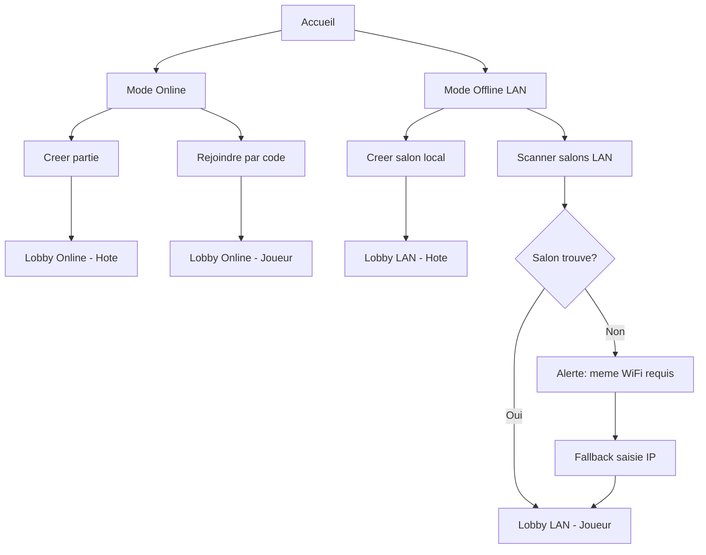
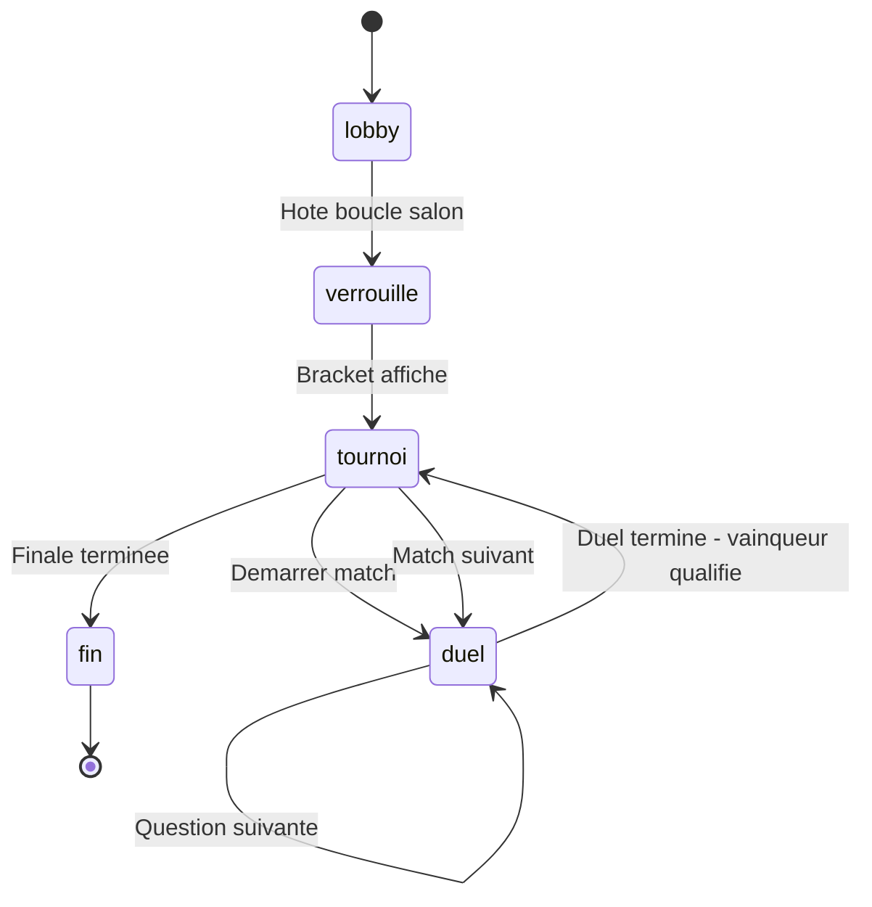
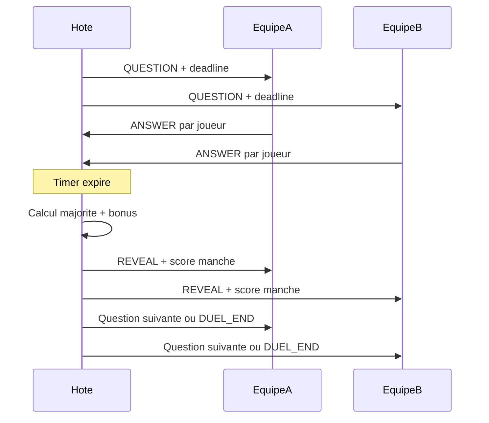
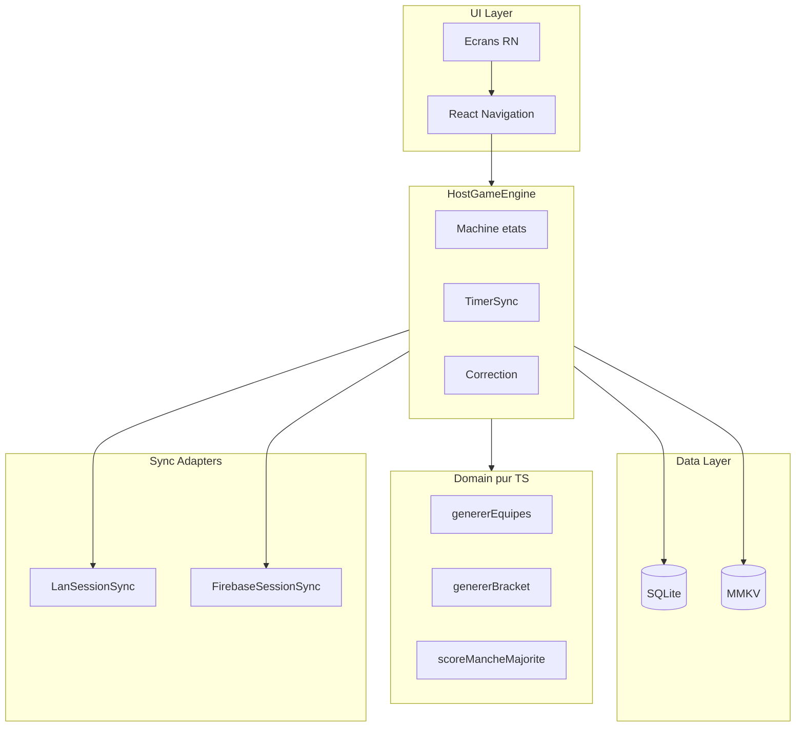
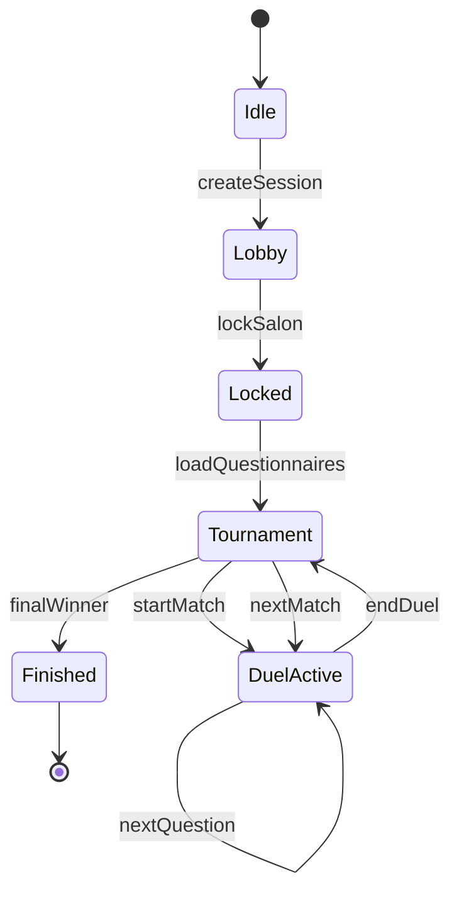

# QuizGame — Conception complète et roadmap de développement

Document de référence pour le développement incrémental de l'application QuizGame (React Native CLI). Chaque sprint livre une fonctionnalité **réelle et testable** sur appareils physiques — pas de mocks.

**Sources** : [vue.txt](vue.txt) + décisions validées en conception.

---

## Table des matières

1. [Vision produit et parcours utilisateur](#1-vision-produit-et-parcours-utilisateur)
2. [Règles métier détaillées](#2-règles-métier-détaillées)
3. [Architecture technique](#3-architecture-technique)
4. [Schémas de données](#4-schémas-de-données)
5. [Sécurité et contraintes plateforme](#5-sécurité-et-contraintes-plateforme)
6. [Dépendances npm par sprint](#6-dépendances-npm-par-sprint)
7. [Sprints de développement](#7-sprints-de-développement)
8. [Annexes](#8-annexes)

---

## 1. Vision produit et parcours utilisateur

### 1.1 Résumé

QuizGame est une application mobile de quiz compétitif par **équipes**, avec tournoi à élimination directe. Deux modes de connexion :

- **Online** : créer ou rejoindre une partie via un code à 6 caractères alphanumériques (Firebase Realtime Database).
- **Offline (LAN)** : le maître héberge un salon sur le réseau WiFi local ; les joueurs le découvrent en 1 clic (NSD/Zeroconf) ou saisissent l'IP en fallback.

Le **maître (hôte)** ne joue pas. Il gère le salon, verrouille les équipes, pilote les duels, valide les corrections et diffuse l'état à tous les participants.

### 1.2 Rôles

| Rôle | Responsabilités |
|------|-----------------|
| **Hôte** | Créer salon, choisir/générer questionnaires, verrouiller équipes, timer, correction, avancement bracket |
| **Joueur** | Rejoindre salon, saisir pseudo, répondre aux QCM dans le duel de son équipe, consulter résultats |

### 1.3 États de session

```
lobby → verrouille → tournoi → duel → fin
```

| État | Description |
|------|-------------|
| `lobby` | Joueurs rejoignent, pseudo affiché, hôte attend |
| `verrouille` | Hôte a cliqué « Boucler le salon » : équipes formées, bracket généré |
| `tournoi` | Affichage bracket, attente du duel en cours |
| `duel` | 2 équipes s'affrontent sur 10 questions QCM |
| `fin` | Vainqueur du tournoi, historique, déverrouillage questionnaires |

### 1.4 Parcours — Écran d'accueil



### 1.5 Cycle de vie d'une partie



### 1.6 Flux d'un duel (séquentiel)



---

## 2. Règles métier détaillées

### 2.1 Formation des équipes

**Déclencheur** : le hôte clique « Boucler le salon ».

**Algorithme** :

1. `X` = nombre de joueurs connectés. Minimum : 2. Si `X < 2` → erreur bloquante.
2. `N` = nombre d'équipes :
   - Si `X >= 4` → `N = 4`
   - Sinon → `N = 2`
3. **Distribution round-robin** : mélanger aléatoirement les joueurs, puis assigner `joueur[i] → equipe[i % N]`.
4. **Bonus de consolation** :
   - `tailleMax` = taille de la plus grande équipe
   - `bonusPoints = (tailleMax - tailleEquipe) × 10`
   - Appliqué **au début de chaque duel** (ajouté au score de manches de l'équipe)

**Exemple — 10 joueurs, 4 équipes** :

| Équipe | Joueurs | Bonus |
|--------|---------|-------|
| Équipe 1 | 3 | 0 |
| Équipe 2 | 3 | 0 |
| Équipe 3 | 2 | 10 |
| Équipe 4 | 2 | 10 |

### 2.2 Arbre de tournoi (élimination directe)

- Format : single elimination, **un duel à la fois** (séquentiel).
- Nombre de duels total pour `N` équipes : `N - 1`.
- Duels par round :
  - Round 1 : `N / 2` matchs
  - Round 2 : `N / 4` matchs
  - … jusqu'à la finale (1 match)

**Exemple — 4 équipes** :

```
Demi-finale 1 : Équipe 1 vs Équipe 2
Demi-finale 2 : Équipe 3 vs Équipe 4
Finale        : Vainqueur DF1 vs Vainqueur DF2
```

**Exemple — 8 équipes** :

```
Quarts (4 matchs) → Demies (2 matchs) → Finale (1 match) = 7 duels
```

### 2.3 Mécanique de duel

| Paramètre | Valeur |
|-----------|--------|
| Format | QCM, 4 options (A, B, C, D) |
| Questions par duel | 10 |
| Participants | Tous les membres des 2 équipes en lice |
| Visibilité | Question visible par les 2 équipes simultanément |
| Timer | 20 secondes par défaut (configurable par l'hôte) |
| Non-réponse | Compte comme réponse incorrecte |

### 2.4 Scoring — règle de majorité

Pour **chaque question** :

1. Compter les bonnes réponses par équipe (chaque joueur répond individuellement).
2. L'équipe avec le **plus** de bonnes réponses remporte **1 manche**.
3. **Égalité** (même nombre de bonnes réponses) → **aucune manche** attribuée.

**Score de duel** :

- `scoreEquipe = manchesGagnees + bonusConsolation` (bonus ajouté une fois au début)
- Victoire du duel : équipe avec le plus de manches gagnées sur les 10 questions.
- Égalité après 10 questions → **manche supplémentaire** (question 11) jusqu'à départage.

**Exemple chiffré** — Équipe A (3 joueurs) vs Équipe B (2 joueurs, bonus +10) :

| Question | A correctes | B correctes | Manche |
|----------|-------------|-------------|--------|
| Q1 | 2 | 1 | A |
| Q2 | 1 | 2 | B |
| Q3 | 3 | 0 | A |
| … | … | … | … |

À la fin : A = 6 manches, B = 4 manches + 10 bonus → B gagne (14 vs 6).

> Le bonus de consolation compense le désavantage numérique. Ajuster `VALEUR_BONUS_PAR_MEMBRE_MANQUANT` (défaut : 10) après tests terrain.

### 2.5 Questionnaires et tournoi

| Règle | Détail |
|-------|--------|
| Questions par duel | 10 |
| Génération au verrouillage | `N_equipes / 2` questionnaires pour le **1er tour** |
| Rounds suivants | Génération IA à l'avancement du bracket **ou** questionnaire public en cache |
| Mode offline | Tous les questionnaires nécessaires doivent être **préparés avant** la coupure réseau (publics cachés ou génération en amont) |
| Verrouillage | Statut `verrouille` : contenu inaccessible (même pour l'hôte via UI) jusqu'à `fin` |
| Déverrouillage | À l'état `fin`, statut passe à `termine` → historique et révision |

**Tableau questionnaires par taille de tournoi** :

| Équipes | Duels total | Questionnaires R1 | Questionnaires rounds suivants | Total questionnaires |
|---------|-------------|-------------------|-------------------------------|---------------------|
| 4 | 3 | 2 | 1 (finale) | 3 |
| 8 | 7 | 4 | 2 (demies) + 1 (finale) | 7 |

### 2.6 Questionnaires publics

- Lors de la création (IA ou import), le hôte coche **« Rendre public »**.
- En fin de partie **online**, si `isPublic = true`, copie vers `/questionnaires_publics/{id}` sur Firebase.
- Tout utilisateur peut parcourir et télécharger les publics (cache SQLite local).
- Réutilisables en LAN sans connexion Internet.

### 2.7 PDF et génération IA

1. Hôte sélectionne un PDF → extraction de texte **locale** (fichier jamais uploadé).
2. Si **hors-ligne** : message « Vous devez être connecté pour générer des questions ».
3. Si **en ligne** : texte extrait envoyé à l'API IA (clé utilisateur) → JSON validé → insertion SQLite `verrouille`.

---

## 3. Architecture technique

### 3.1 Stack technologique

| Couche | Technologie |
|--------|-------------|
| Framework | React Native CLI 0.85 + TypeScript |
| Navigation | `@react-navigation/native` + stack navigator |
| État léger | `react-native-mmkv` (session, prefs, config timer) |
| Données relationnelles | `react-native-quick-sqlite` |
| Online sync | `@react-native-firebase/database` (Realtime Database) |
| LAN discovery | `react-native-zeroconf` (NSD/Bonjour) |
| LAN transport | WebSocket via `react-native-tcp-socket` |
| PDF | `react-native-document-picker` + extraction texte native |
| Validation | `zod` |
| Identifiants | `uuid` |
| Sécurité clé API | `react-native-keychain` |

### 3.2 Diagramme d'architecture



### 3.3 Principe clé : hôte autoritaire

- L'**hôte** est la source de vérité pour timer, correction et avancement.
- Les **clients** envoient leurs réponses à l'hôte.
- L'hôte diffuse les corrections — les clients ne reçoivent **jamais** `reponse_correcte` avant le `REVEAL`.
- Les adaptateurs `LanSessionSync` et `FirebaseSessionSync` implémentent la même interface — le `HostGameEngine` est agnostique du transport.

### 3.4 Interface SessionSync

```typescript
interface SessionSync {
  // Salon
  createSession(nom: string): Promise<string>;
  joinSession(code: string, pseudo: string): Promise<void>;
  onPlayerList(callback: (players: Joueur[]) => void): void;

  // Jeu (hôte → clients)
  broadcastLockSalon(equipes: Equipe[], bracket: Bracket): void;
  broadcastQuestion(payload: QuestionPayload): void;
  broadcastReveal(payload: RevealPayload): void;
  broadcastDuelEnd(payload: DuelEndPayload): void;
  broadcastRoundAdvance(bracket: Bracket): void;
  broadcastGameEnd(payload: GameEndPayload): void;

  // Jeu (clients → hôte)
  submitAnswer(duelId: string, option: string): void;
  onAnswer(callback: (playerId: string, option: string) => void): void;

  disconnect(): void;
}
```

### 3.5 Arborescence `src/`

```
src/
├── domain/
│   ├── teams.ts              # genererEquipes, calculerBonus
│   ├── bracket.ts            # genererBracket, avancerBracket
│   ├── scoring.ts            # scoreMancheMajorite, calculerVainqueurDuel
│   └── code.ts               # genererCode6, validation
├── data/
│   ├── sqlite/
│   │   ├── database.ts       # init, migrations
│   │   ├── migrations/       # v001_initial.sql, ...
│   │   ├── QuestionnaireRepository.ts
│   │   ├── PartieRepository.ts
│   │   └── HistoriqueRepository.ts
│   └── mmkv/
│       ├── storage.ts
│       └── keys.ts
├── sync/
│   ├── SessionSync.ts        # interface
│   ├── LanSessionSync.ts
│   ├── FirebaseSessionSync.ts
│   ├── lan/
│   │   ├── WsServer.ts
│   │   ├── WsClient.ts
│   │   └── ZeroconfService.ts
│   └── messages.ts           # types des messages WS/RTDB
├── services/
│   ├── HostGameEngine.ts     # FSM lobby → fin
│   ├── HostQuestionService.ts
│   ├── QuestionGenerator.ts  # appel IA
│   ├── PdfExtractor.ts
│   └── PublicCatalogService.ts
├── types/
│   ├── joueur.ts
│   ├── equipe.ts
│   ├── question.ts
│   ├── partie.ts
│   └── bracket.ts
├── ui/
│   ├── navigation/
│   │   ├── RootNavigator.tsx
│   │   └── types.ts
│   ├── screens/
│   │   ├── HomeScreen.tsx
│   │   ├── online/
│   │   │   ├── CreateOnlineScreen.tsx
│   │   │   ├── JoinOnlineScreen.tsx
│   │   │   └── OnlineLobbyScreen.tsx
│   │   ├── lan/
│   │   │   ├── CreateLanScreen.tsx
│   │   │   ├── ScanLanScreen.tsx
│   │   │   └── LanLobbyScreen.tsx
│   │   ├── host/
│   │   │   ├── HostDashboardScreen.tsx
│   │   │   ├── QuestionnaireSelectScreen.tsx
│   │   │   └── PdfUploadScreen.tsx
│   │   ├── game/
│   │   │   ├── BracketScreen.tsx
│   │   │   ├── DuelScreen.tsx
│   │   │   └── GameEndScreen.tsx
│   │   └── catalog/
│   │       ├── PublicListScreen.tsx
│   │       └── HistoryScreen.tsx
│   └── components/
│       ├── PlayerList.tsx
│       ├── TeamCard.tsx
│       ├── QuestionCard.tsx
│       ├── TimerBar.tsx
│       ├── BracketView.tsx
│       └── OptionButton.tsx
└── utils/
    ├── network.ts
    └── shuffle.ts
```

### 3.6 Machine à états — HostGameEngine



Événements internes : `PLAYER_JOINED`, `PLAYER_LEFT`, `TIMER_EXPIRED`, `ALL_ANSWERS_RECEIVED`, `ROUND_COMPLETE`, `QUESTIONNAIRE_NEEDED`.

---

## 4. Schémas de données

### 4.1 SQLite — schéma complet

```sql
-- Migration v001

CREATE TABLE parties (
    id TEXT PRIMARY KEY,
    nom TEXT NOT NULL,
    mode TEXT NOT NULL CHECK(mode IN ('online', 'lan')),
    code TEXT,
    statut TEXT NOT NULL CHECK(statut IN ('lobby', 'verrouille', 'tournoi', 'duel', 'fin')),
    equipe_gagnante_id TEXT,
    date_creation INTEGER NOT NULL,
    date_fin INTEGER
);

CREATE TABLE questionnaires (
    id TEXT PRIMARY KEY,
    partie_id TEXT,
    titre TEXT NOT NULL,
    date_creation INTEGER NOT NULL,
    statut TEXT NOT NULL CHECK(statut IN ('verrouille', 'termine')) DEFAULT 'verrouille',
    source TEXT NOT NULL CHECK(source IN ('pdf', 'ia', 'public')),
    is_public INTEGER NOT NULL DEFAULT 0,
    duel_id TEXT,
    round_index INTEGER,
    FOREIGN KEY (partie_id) REFERENCES parties(id) ON DELETE CASCADE
);

CREATE TABLE questions (
    id TEXT PRIMARY KEY,
    questionnaire_id TEXT NOT NULL,
    index_ordre INTEGER NOT NULL,
    texte_question TEXT NOT NULL,
    options TEXT NOT NULL,       -- JSON: ["A...", "B...", "C...", "D..."]
    reponse_correcte TEXT NOT NULL,
    FOREIGN KEY (questionnaire_id) REFERENCES questionnaires(id) ON DELETE CASCADE
);

CREATE TABLE historique_parties (
    id TEXT PRIMARY KEY,
    partie_id TEXT NOT NULL,
    date_partie INTEGER NOT NULL,
    nom_partie TEXT NOT NULL,
    nom_questionnaire TEXT NOT NULL,
    equipe_gagnante TEXT NOT NULL,
    mode TEXT NOT NULL,
    FOREIGN KEY (partie_id) REFERENCES parties(id)
);

CREATE TABLE classement_joueurs (
    pseudo TEXT PRIMARY KEY,
    points_totaux INTEGER NOT NULL DEFAULT 0,
    parties_jouees INTEGER NOT NULL DEFAULT 0,
    victoires INTEGER NOT NULL DEFAULT 0
);

CREATE TABLE questionnaires_publics_cache (
    id TEXT PRIMARY KEY,
    titre TEXT NOT NULL,
    auteur TEXT,
    date_publication INTEGER NOT NULL,
    nb_questions INTEGER NOT NULL,
    firebase_id TEXT NOT NULL UNIQUE,
    date_telecharge INTEGER NOT NULL
);

CREATE INDEX idx_questions_questionnaire ON questions(questionnaire_id);
CREATE INDEX idx_questionnaires_partie ON questionnaires(partie_id);
CREATE INDEX idx_questionnaires_duel ON questionnaires(duel_id);
```

### 4.2 Contrats TypeScript — entités principales

```typescript
interface Joueur {
  id: string;
  pseudo: string;
  equipeId?: string;
  connected: boolean;
}

interface Equipe {
  id: string;
  nom: string;
  membres: Joueur[];
  bonusPoints: number;
}

interface Question {
  id: string;
  texte: string;
  options: [string, string, string, string];
  // reponse_correcte : accessible uniquement via HostQuestionService
}

interface Match {
  id: string;
  roundIndex: number;
  equipeAId: string;
  equipeBId: string;
  vainqueurId?: string;
  questionnaireId?: string;
  statut: 'pending' | 'active' | 'completed';
}

interface Bracket {
  nbEquipes: number;
  rounds: Match[][];
}
```

### 4.3 Firebase Realtime Database

```
/sessions/{code6}/
  meta/
    nom: string
    hoteId: string
    statut: "lobby" | "verrouille" | "tournoi" | "duel" | "fin"
    createdAt: number
    timerSeconds: number
  joueurs/
    {playerId}/
      pseudo: string
      equipeId: string | null
      connected: boolean
  equipes/
    {equipeId}/
      nom: string
      bonusPoints: number
      membres: string[]        # playerIds
  bracket/
    rounds: Match[][]          # JSON sérialisé
  etat/
    phase: string
    duelActifId: string | null
    questionIndex: number
    deadline: number | null
    scores: { [equipeId]: number }
  reponses/
    {duelId}/
      {playerId}/
        option: string
        timestamp: number

/questionnaires_publics/
  {id}/
    titre: string
    auteur: string
    datePublication: number
    nbQuestions: number
    questions/               # lecture seule, téléchargement complet
      {index}/
        texte: string
        options: string[]
        reponse_correcte: string
```

**Règle** : `reponse_correcte` n'apparaît **jamais** sous `/sessions/`. Les clients en ligne reçoivent la correction via `etat/reveal` (option correcte révélée uniquement après timer).

### 4.4 Protocole LAN — messages WebSocket

Tous les messages suivent l'enveloppe :

```typescript
interface WsMessage {
  type: string;
  payload: unknown;
  timestamp: number;
  sessionId: string;
}
```

| Type | Direction | Payload |
|------|-----------|---------|
| `JOIN` | Client → Hôte | `{ pseudo: string }` |
| `JOIN_ACK` | Hôte → Client | `{ playerId: string, sessionId: string }` |
| `PLAYER_LIST` | Hôte → Tous | `{ joueurs: Joueur[] }` |
| `LOCK_SALON` | Hôte → Tous | `{ equipes: Equipe[], bracket: Bracket }` |
| `BRACKET_UPDATE` | Hôte → Tous | `{ bracket: Bracket }` |
| `QUESTION` | Hôte → Tous | `{ duelId, index, texte, options, deadline }` |
| `ANSWER` | Client → Hôte | `{ duelId, option }` |
| `REVEAL` | Hôte → Tous | `{ duelId, index, optionCorrecte, scoresManche, scoresDuel }` |
| `DUEL_END` | Hôte → Tous | `{ duelId, vainqueurId, scoresFinaux }` |
| `ROUND_ADVANCE` | Hôte → Tous | `{ bracket, prochainDuelId }` |
| `GAME_END` | Hôte → Tous | `{ vainqueurEquipeId, classement }` |
| `ERROR` | Hôte → Client | `{ code, message }` |
| `PING` / `PONG` | Bidirectionnel | `{}` |

**Service Zeroconf** :

- Type : `_quizgame._tcp`
- Port par défaut : `41234`
- TXT record : `{ sessionId, nom, code }`

---

## 5. Sécurité et contraintes plateforme

### 5.1 Anti-triche

| Mesure | Implémentation |
|--------|----------------|
| Réponses cachées | `HostQuestionService` — seul module lisant `reponse_correcte` |
| Repository filtré | `QuestionnaireRepository.getQuestionsForPlayer()` exclut `reponse_correcte` |
| UI verrouillée | Écrans consultation refusent `statut = verrouille` |
| Sync | Messages `QUESTION` sans `reponse_correcte` ; `REVEAL` envoie l'option correcte post-timer |
| Fin de partie | `statut → termine` ; historique accessible |

### 5.2 Stockage clé API

- Saisie dans écran Réglages.
- Persistance via `react-native-keychain` (jamais en clair dans MMKV/SQLite).
- Utilisée uniquement par `QuestionGenerator` côté hôte.

### 5.3 Permissions Android (`AndroidManifest.xml`)

```xml
<uses-permission android:name="android.permission.INTERNET" />
<uses-permission android:name="android.permission.ACCESS_NETWORK_STATE" />
<uses-permission android:name="android.permission.ACCESS_WIFI_STATE" />
<uses-permission android:name="android.permission.CHANGE_WIFI_MULTICAST_STATE" />
```

### 5.4 Permissions iOS (`Info.plist`)

```xml
<key>NSLocalNetworkUsageDescription</key>
<string>QuizGame utilise le réseau local pour connecter les joueurs au salon.</string>
<key>NSBonjourServices</key>
<array>
  <string>_quizgame._tcp</string>
</array>
```

### 5.5 Limites et constantes

| Constante | Valeur |
|-----------|--------|
| `MIN_JOUEURS` | 2 |
| `MAX_EQUIPES` | 16 |
| `QUESTIONS_PAR_DUEL` | 10 |
| `TIMER_DEFAULT_SECONDS` | 20 |
| `BONUS_PAR_MEMBRE_MANQUANT` | 10 |
| `CODE_LENGTH` | 6 (alphanumérique majuscules, sans O/0/I/1 pour lisibilité) |
| `WS_PORT` | 41234 |

### 5.6 Gestion réseau

- **LAN** : si scan NSD échoue → alerte « Connectez-vous au même WiFi » + saisie IP manuelle.
- **Online** : Firebase presence via `connected` flag ; reconnexion basique sprint S11.
- **Offline jeu** : aucune dépendance Internet pendant le tournoi si questionnaires pré-chargés.

---

## 6. Dépendances npm par sprint

| Sprint | Packages à installer |
|--------|---------------------|
| S0 | `@react-navigation/native`, `@react-navigation/native-stack`, `react-native-screens`, `react-native-quick-sqlite`, `react-native-mmkv`, `uuid`, `zod` |
| S1 | — (tests Jest existants) |
| S2 | — |
| S3 | — |
| S4 | `react-native-zeroconf`, `react-native-tcp-socket` |
| S5 | — |
| S6 | — |
| S7 | `@react-native-firebase/app`, `@react-native-firebase/database` |
| S8 | `react-native-document-picker`, `react-native-keychain`, `react-native-pdf` (ou lib extraction native) |
| S9 | — |
| S10 | — |
| S11 | `@react-native-community/netinfo` |

---

## 7. Sprints de développement

Chaque sprint est autonome, livrable et testable. Ne pas passer au sprint suivant tant que les critères d'acceptation ne sont pas validés.

---

### Sprint S0 — Fondations ✅

> **Statut** : ✅ Terminé — fondations en place (2026-06-05)

**Objectif** : structure projet, navigation, base de données initialisée, types partagés.

**Tâches** :

1. Créer l'arborescence `src/` (cf. section 3.5).
2. Configurer alias TypeScript `@/` → `src/` dans `tsconfig.json`.
3. Installer navigation + SQLite + MMKV.
4. Implémenter `database.ts` + migration `v001_initial.sql`.
5. Créer tous les types dans `src/types/`.
6. Écran `HomeScreen` avec choix Online / Offline.
7. Brancher `RootNavigator` dans `App.tsx`.

**Fichiers clés** :

- `src/data/sqlite/database.ts`
- `src/data/sqlite/migrations/v001_initial.sql`
- `src/data/mmkv/storage.ts`
- `src/ui/navigation/RootNavigator.tsx`
- `src/ui/screens/HomeScreen.tsx`

**Critères d'acceptation** :

- [x] L'app démarre sans erreur sur Android et iOS.
- [x] SQLite crée les 6 tables au premier lancement.
- [x] MMKV accessible (test lecture/écriture).
- [x] Navigation Home → placeholder Online/Offline fonctionne.

**Tests manuels** : lancer `npm run android` / `npm run ios`, vérifier logs « DB migrated v001 ».

**Durée estimée** : 3–5 jours.

---

### Sprint S1 — Domaine métier ✅

> **Statut** : ✅ Terminé — domaine pur + 10 tests Jest (2026-06-05)

**Objectif** : logique pure testée — équipes, bracket, scoring.

**Tâches** :

1. `genererEquipes(joueurs)` — round-robin, bonus.
2. `genererBracket(nbEquipes)` — élimination directe.
3. `avancerBracket(bracket, matchId, vainqueurId)`.
4. `scoreMancheMajorite(reponsesA, reponsesB, correcte)` → `'A' | 'B' | 'egalite'`.
5. `calculerVainqueurDuel(manches, bonusA, bonusB)`.
6. `genererCode6()` — 6 caractères alphanumériques.
7. Tests Jest exhaustifs (cas 2, 4, 10 joueurs ; égalités ; bonus).

**Fichiers clés** :

- `src/domain/teams.ts`
- `src/domain/bracket.ts`
- `src/domain/scoring.ts`
- `src/domain/code.ts`
- `__tests__/domain/teams.test.ts`
- `__tests__/domain/bracket.test.ts`
- `__tests__/domain/scoring.test.ts`

**Critères d'acceptation** :

- [x] 10 joueurs → 4 équipes (3-3-2-2), bonus 0/0/10/10.
- [x] Bracket 8 équipes → 7 matchs structurés.
- [x] Majorité : 2 correctes vs 1 → équipe A gagne la manche.
- [x] Égalité majorité → `egalite`, aucun point.
- [x] `npm test` passe à 100 %.

**Durée estimée** : 3–4 jours.

---

### Sprint S2 — Persistance et verrouillage ✅

> **Statut** : ✅ Terminé — repositories SQLite + HostQuestionService (2026-06-05)

**Objectif** : repositories SQLite, service questions hôte, enforcement du verrouillage.

**Tâches** :

1. `QuestionnaireRepository` — CRUD, `getQuestionsForHost()`, `getQuestionsForPlayer()` (sans réponse).
2. `PartieRepository` — créer, mettre à jour statut, lier questionnaires.
3. `HistoriqueRepository` — squelette (utilisé en S10).
4. `HostQuestionService` — correction, reveal, vérifie statut verrouillé.
5. Fonction `deverrouillerQuestionnaires(partieId)` appelée à la fin.

**Fichiers clés** :

- `src/data/sqlite/QuestionnaireRepository.ts`
- `src/data/sqlite/PartieRepository.ts`
- `src/services/HostQuestionService.ts`

**Critères d'acceptation** :

- [x] Insertion questionnaire + 10 questions en transaction SQLite.
- [x] `getQuestionsForPlayer()` ne retourne jamais `reponse_correcte`.
- [x] `getQuestionsForHost()` accessible uniquement si appelé depuis `HostQuestionService`.
- [x] Tentative lecture questionnaire `verrouille` via UI → refus.
- [x] `deverrouillerQuestionnaires` change statut → `termine`.

**Tests manuels** : script ou écran debug temporaire insérant un questionnaire et vérifiant le filtrage.

**Durée estimée** : 4–5 jours.

---

### Sprint S3 — Moteur hôte (FSM)

**Objectif** : `HostGameEngine` orchestrant lobby → fin sur l'appareil hôte, sans réseau.

**Tâches** :

1. Implémenter FSM complète (cf. section 3.6).
2. Gérer timer interne (`setInterval` + `deadline` timestamp).
3. Collecter réponses (simulation locale via callbacks pour test hôte seul).
4. Orchestrer : lock → bracket → duel 10 questions → reveal → vainqueur → round suivant.
5. Écrans hôte : `HostDashboardScreen`, `BracketScreen`, `DuelScreen` (vue hôte).
6. Charger questionnaires depuis SQLite (seed manuel ou insertion test).

**Fichiers clés** :

- `src/services/HostGameEngine.ts`
- `src/ui/screens/host/HostDashboardScreen.tsx`
- `src/ui/screens/game/BracketScreen.tsx`
- `src/ui/screens/game/DuelScreen.tsx`

**Critères d'acceptation** :

- [ ] Hôte crée partie LAN locale (sans WS), ajoute joueurs fictifs via debug.
- [ ] Verrouillage forme équipes et affiche bracket.
- [ ] Duel complet 10 questions avec timer et reveal.
- [ ] Vainqueur duel qualifié, finale jouable, écran `fin` affiché.
- [ ] Questionnaires déverrouillés en fin de partie.

**Durée estimée** : 5–7 jours.

---

### Sprint S4 — LAN : lobby

**Objectif** : connexion réelle multi-appareils — découverte et lobby.

**Tâches** :

1. `ZeroconfService` — publier (hôte) et scanner (client).
2. `WsServer` — WebSocket sur port 41234 (hôte).
3. `WsClient` — connexion client.
4. `LanSessionSync` — implémente `SessionSync` (JOIN, PLAYER_LIST).
5. Écrans : `CreateLanScreen`, `ScanLanScreen`, `LanLobbyScreen`.
6. Fallback saisie IP si scan échoue.
7. Permissions Android/iOS (section 5.3–5.4).

**Fichiers clés** :

- `src/sync/lan/ZeroconfService.ts`
- `src/sync/lan/WsServer.ts`
- `src/sync/lan/WsClient.ts`
- `src/sync/LanSessionSync.ts`
- `src/ui/screens/lan/CreateLanScreen.tsx`
- `src/ui/screens/lan/ScanLanScreen.tsx`

**Critères d'acceptation** :

- [ ] Hôte crée salon → visible dans scan client (2 appareils physiques, même WiFi).
- [ ] Client rejoint en 1 clic, pseudo affiché chez tous.
- [ ] Déconnexion client → liste mise à jour.
- [ ] Scan échoue sans WiFi commun → message d'erreur + saisie IP fonctionnelle.

**Tests manuels** : 2–4 téléphones Android/iOS sur même réseau WiFi.

**Durée estimée** : 7–10 jours.

---

### Sprint S5 — LAN : tournoi complet

**Objectif** : partie LAN jouable de bout en bout (1er tour + finale).

**Tâches** :

1. Étendre `LanSessionSync` — LOCK_SALON, QUESTION, ANSWER, REVEAL, DUEL_END, GAME_END.
2. Brancher `HostGameEngine` sur `LanSessionSync`.
3. Écran joueur `DuelScreen` — QCM, soumission réponse, attente reveal.
4. Verrouillage salon → équipes + bracket diffusés.
5. Duel séquentiel avec majorité et bonus.
6. Écran `GameEndScreen`.
7. Pré-charger 2 questionnaires (tournoi 4 équipes) en SQLite avant partie.

**Fichiers clés** :

- `src/sync/LanSessionSync.ts` (extension)
- `src/services/HostGameEngine.ts` (intégration sync)
- `src/ui/screens/game/DuelScreen.tsx` (vue joueur)
- `src/ui/screens/game/GameEndScreen.tsx`

**Critères d'acceptation** :

- [ ] 4+ appareils : 1 hôte + 3+ joueurs, tournoi 4 équipes complet.
- [ ] Chaque joueur répond individuellement, reveal synchronisé.
- [ ] Bonus consolation appliqué et visible dans scores.
- [ ] Vainqueur tournoi affiché, questionnaires déverrouillés.

**Durée estimée** : 7–10 jours.

---

### Sprint S6 — Questionnaires multi-rounds

**Objectif** : gérer les questionnaires des rounds 2+ (demies, finale).

**Tâches** :

1. À `ROUND_ADVANCE`, détecter matchs sans questionnaire assigné.
2. **Online** : déclencher génération IA ou sélection public.
3. **Offline** : exiger questionnaire public pré-caché (sinon erreur bloquante avec message clair).
4. UI hôte : indicateur « questionnaires manquants » avant verrouillage offline.
5. Lier `questionnaire.duel_id` et `questionnaire.round_index` en SQLite.

**Fichiers clés** :

- `src/services/HostGameEngine.ts`
- `src/ui/screens/host/QuestionnaireSelectScreen.tsx`

**Critères d'acceptation** :

- [ ] Tournoi 8 équipes LAN (avec publics pré-cachés) jouable sur 3 rounds.
- [ ] Tentative lancer finale sans questionnaire offline → erreur explicite.
- [ ] Chaque duel utilise son questionnaire distinct (10 questions).

**Durée estimée** : 4–5 jours.

---

### Sprint S7 — Firebase online

**Objectif** : mode online fonctionnel — même gameplay que LAN via RTDB.

**Tâches** :

1. Configurer Firebase (projet, `google-services.json`, `GoogleService-Info.plist`).
2. `FirebaseSessionSync` — implémente `SessionSync` via RTDB.
3. `genererCode6()` — unicité vérifiée côté Firebase.
4. Écrans : `CreateOnlineScreen`, `JoinOnlineScreen`, `OnlineLobbyScreen`.
5. Règles Firebase : clients écrivent uniquement `reponses/{duelId}/{playerId}`.
6. Brancher `HostGameEngine` sur adaptateur Firebase.

**Fichiers clés** :

- `src/sync/FirebaseSessionSync.ts`
- `src/ui/screens/online/CreateOnlineScreen.tsx`
- `src/ui/screens/online/JoinOnlineScreen.tsx`

**Critères d'acceptation** :

- [ ] Hôte crée partie online, code affiché.
- [ ] Joueur rejoint avec code depuis autre appareil (4G ou WiFi).
- [ ] Tournoi 4 équipes jouable entièrement online.
- [ ] `reponse_correcte` absente des nœuds clients Firebase.

**Durée estimée** : 7–10 jours.

---

### Sprint S8 — PDF et génération IA

**Objectif** : créer un questionnaire depuis un PDF via IA.

**Tâches** :

1. `PdfExtractor` — sélection document, extraction texte locale.
2. Écran `PdfUploadScreen` — preview texte extrait.
3. `QuestionGenerator` — appel API (OpenAI ou Gemini), prompt structuré (annexe A).
4. Validation Zod du JSON retourné.
5. Insertion SQLite `verrouille`, flag `isPublic`.
6. Écran Réglages — saisie clé API (Keychain).
7. Gestion hors-ligne : erreur si pas de réseau.

**Fichiers clés** :

- `src/services/PdfExtractor.ts`
- `src/services/QuestionGenerator.ts`
- `src/ui/screens/host/PdfUploadScreen.tsx`

**Critères d'acceptation** :

- [ ] PDF texte natif → extraction → génération 10+ questions QCM.
- [ ] Hors-ligne → message « Vous devez être connecté pour générer des questions ».
- [ ] JSON invalide → erreur, aucune insertion partielle.
- [ ] Questionnaire utilisable dans partie LAN et online.

**Durée estimée** : 7–10 jours.

---

### Sprint S9 — Catalogue public

**Objectif** : publication et réutilisation des questionnaires publics.

**Tâches** :

1. `PublicCatalogService` — publier en fin de partie online si `isPublic`.
2. `PublicListScreen` — liste, recherche, téléchargement.
3. Cache SQLite `questionnaires_publics_cache` + copie questions.
4. Sélection public dans `QuestionnaireSelectScreen` (online et LAN).
5. Synchronisation périodique ou pull-to-refresh.

**Fichiers clés** :

- `src/services/PublicCatalogService.ts`
- `src/ui/screens/catalog/PublicListScreen.tsx`
- `src/ui/screens/host/QuestionnaireSelectScreen.tsx`

**Critères d'acceptation** :

- [ ] Partie online terminée avec `isPublic` → visible dans catalogue.
- [ ] Autre appareil télécharge et utilise en partie LAN offline.
- [ ] Public non coché → non publié.

**Durée estimée** : 5–7 jours.

---

### Sprint S10 — Historique et classement

**Objectif** : persistance post-partie et révision.

**Tâches** :

1. Enregistrer `historique_parties` à la fin.
2. Mettre à jour `classement_joueurs` (points, victoires).
3. `HistoryScreen` — liste parties, détail scores.
4. Révision questionnaire déverrouillé (questions + réponses visibles).
5. Lien depuis `GameEndScreen`.

**Fichiers clés** :

- `src/data/sqlite/HistoriqueRepository.ts`
- `src/ui/screens/catalog/HistoryScreen.tsx`

**Critères d'acceptation** :

- [ ] Partie terminée → entrée historique consultable.
- [ ] Classement joueur mis à jour (pseudo comme clé).
- [ ] Questionnaire révisable après `termine`.

**Durée estimée** : 4–5 jours.

---

### Sprint S11 — Robustesse et release

**Objectif** : stabilisation, reconnexion, préparation déploiement.

**Tâches** :

1. Reconnexion joueur (re-JOIN avec même pseudo → réintégration équipe si partie en cours).
2. `@react-native-community/netinfo` — détection perte réseau, messages clairs.
3. Gestion hôte en arrière-plan (Wake Lock Android, alerte iOS).
4. Tests de charge : 16 joueurs sur LAN.
5. Revue permissions, ProGuard, icônes, splash.
6. Checklist déploiement (Play Store / App Store).

**Critères d'acceptation** :

- [ ] Joueur déconnecté puis reconnecté récupère sa place (si duel non terminé).
- [ ] Perte WiFi → message utilisateur, pas de crash.
- [ ] Build release Android et iOS compilable.
- [ ] Checklist section 8.4 validée.

**Durée estimée** : 5–7 jours.

---

### Vue d'ensemble des sprints

| Sprint | Nom | Durée estimée | Dépendances |
|--------|-----|---------------|-------------|
| S0 | Fondations ✅ | 3–5 j | — |
| S1 | Domaine métier ✅ | 3–4 j | S0 |
| S2 | Persistance ✅ | 4–5 j | S0 |
| S3 | Moteur hôte FSM | 5–7 j | S1, S2 |
| S4 | LAN lobby | 7–10 j | S3 |
| S5 | LAN tournoi | 7–10 j | S4 |
| S6 | Multi-rounds | 4–5 j | S5 |
| S7 | Firebase online | 7–10 j | S5 |
| S8 | PDF + IA | 7–10 j | S2 |
| S9 | Catalogue public | 5–7 j | S7, S8 |
| S10 | Historique | 4–5 j | S5 |
| S11 | Release | 5–7 j | Tous |

**Durée totale estimée** : 14–18 semaines (1 développeur).

---

## 8. Annexes

### 8.1 Prompt IA — génération de questions QCM

```
Tu es un générateur de questions de quiz. À partir du texte fourni, génère exactement {NB_QUESTIONS} questions QCM en français.

Règles :
- Chaque question a exactement 4 options (A, B, C, D).
- Une seule bonne réponse par question.
- Les questions doivent être basées uniquement sur le texte fourni.
- Réponds UNIQUEMENT en JSON valide, sans markdown.

Format :
{
  "titre": "Titre du questionnaire",
  "questions": [
    {
      "texte": "Question ?",
      "options": ["Option A", "Option B", "Option C", "Option D"],
      "reponse_correcte": "Option B"
    }
  ]
}

Texte source :
---
{TEXT_EXTRAIT}
---
```

**Schéma Zod** :

```typescript
const QuestionIaSchema = z.object({
  texte: z.string().min(10),
  options: z.tuple([z.string(), z.string(), z.string(), z.string()]),
  reponse_correcte: z.string(),
}).refine(q => q.options.includes(q.reponse_correcte));

const QuestionnaireIaSchema = z.object({
  titre: z.string().min(3),
  questions: z.array(QuestionIaSchema).min(10),
});
```

### 8.2 Exemples de parties

#### Partie A — 4 équipes, 10 joueurs (LAN)

1. Hôte crée salon LAN, 10 joueurs rejoignent.
2. Hôte sélectionne 2 questionnaires publics (R1) + 1 (finale) depuis cache.
3. Hôte boucle → équipes 3-3-2-2, bonus 0/0/10/10.
4. DF1 : Éq1 vs Éq2 → 10 questions → vainqueur Éq1.
5. DF2 : Éq3 vs Éq4 → vainqueur Éq4 (bonus décisif).
6. Finale : Éq1 vs Éq4 → vainqueur tournoi.
7. Historique + déverrouillage.

#### Partie B — 8 équipes, 16 joueurs (Online)

1. Hôte crée partie online, génère questionnaires R1 via PDF (4 questionnaires IA).
2. 16 joueurs rejoignent par code.
3. Quarts → demies : questionnaires publics ou IA à l'avancement.
4. Finale → vainqueur, publication optionnelle du questionnaire.

### 8.3 Checklist de test par sprint

| Sprint | Test physique requis |
|--------|---------------------|
| S0 | 1 appareil — démarrage |
| S1 | `npm test` — aucun appareil |
| S2 | 1 appareil — insertion SQLite |
| S3 | 1 appareil — parcours hôte complet |
| S4 | 2+ appareils — même WiFi — lobby |
| S5 | 4+ appareils — tournoi LAN complet |
| S6 | 8+ appareils ou 4 avec rounds simulés |
| S7 | 4+ appareils — online (WiFi/4G mixte) |
| S8 | 1 appareil — PDF + Internet |
| S9 | 2 appareils — publier + télécharger |
| S10 | 1 appareil — historique |
| S11 | 8+ appareils — stress test |

### 8.4 Checklist déploiement

- [ ] Icône application (Android adaptive + iOS AppIcon)
- [ ] Splash screen
- [ ] `versionCode` / `versionName` incrémentés
- [ ] Firebase prod configuré (pas de clés dev)
- [ ] Règles RTDB déployées (écriture restreinte)
- [ ] Permissions justifiées (fiches Play Store / App Privacy)
- [ ] Build release signé (keystore Android, certificat iOS)
- [ ] Test sur appareil physique release build

### 8.5 Risques identifiés

| Risque | Impact | Mitigation |
|--------|--------|------------|
| NSD/Zeroconf peu fiable selon routeurs | Scan LAN échoue | Fallback saisie IP ; tests multi-routeurs |
| App hôte en arrière-plan tuée (OS) | Partie interrompue | Wake Lock Android ; avertissement iOS ; garder écran actif |
| PDF scanné (image) sans OCR | Extraction vide | Détecter texte vide → message « PDF non supporté, utilisez un PDF texte » |
| JSON IA malformé | Questionnaire incomplet | Validation Zod stricte ; retry avec prompt correctif |
| Triche SQLite locale | Lecture réponses | Acceptable pour contexte scolaire ; hôte autoritaire pour le jeu live |
| Latence Firebase | Désync timer | Timer basé sur `deadline` timestamp serveur hôte, pas sur client |

### 8.6 Règles Firebase RTDB (brouillon)

```json
{
  "rules": {
    "sessions": {
      "$code": {
        ".read": true,
        "reponses": {
          "$duelId": {
            "$playerId": {
              ".write": "auth != null || $playerId === newData.child('playerId').val()"
            }
          }
        },
        "meta": { ".write": "data.child('hoteId').val() === auth.uid" },
        "etat": { ".write": "data.child('hoteId').val() === auth.uid" }
      }
    },
    "questionnaires_publics": {
      ".read": true,
      ".write": "auth != null"
    }
  }
}
```

> Affiner selon stratégie auth (anonyme Firebase Auth recommandé pour le MVP).

---

## Historique des décisions

| Date | Décision |
|------|----------|
| Conception initiale | Équipes 4 préférées, bonus points, PDF local, Firebase |
| Validation scoring | Majorité par question (manche), égalité = 0 point |
| Validation questionnaires | 10 questions/duel, R1 préparé à verrouillage, rounds suivants à l'avancement |
| Validation sync | Hôte autoritaire, LAN WebSocket + Firebase RTDB |
| Validation duels | Séquentiels (un à la fois) |

---

*Document généré pour le projet QuizGame — React Native CLI. Référence unique pour le développement sprint par sprint.*
